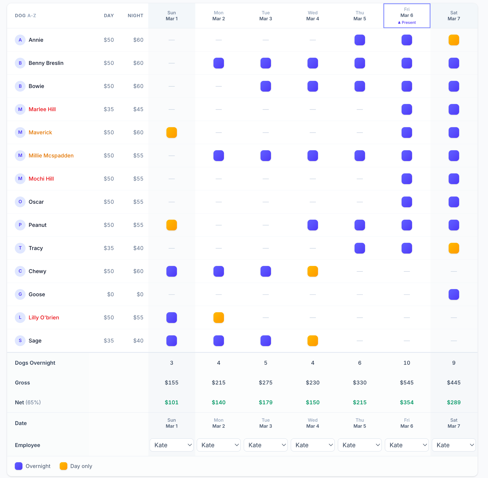
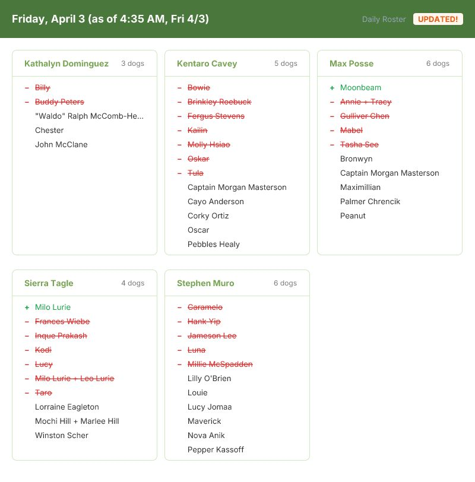
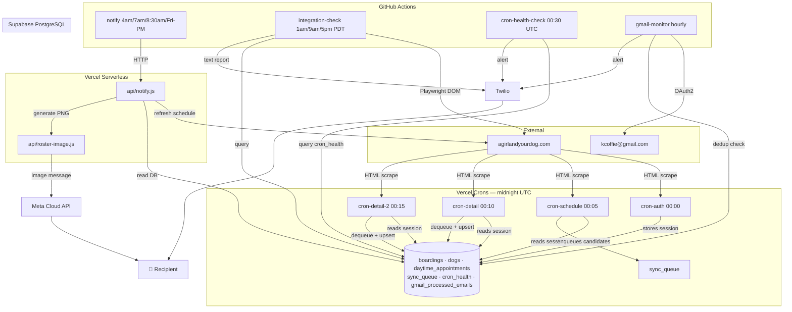

# Qboard — Dog Boarding Operations Platform

**Live:** [qboarding.vercel.app](https://qboarding.vercel.app) &nbsp;|&nbsp; **Tests:** 946 passing (54 files) &nbsp;|&nbsp; **Version:** v5.4.0 &nbsp;|&nbsp; **[Changelog](CHANGELOG.md)**

A production operations platform for a dog boarding business — built without a vendor API, running autonomously on a Vercel Hobby plan, and hardened against silent failures at three independent layers.

---

## What it looks like

**Boarding matrix** — the main app UI, showing each dog's overnight stay across a 7-day window with day/night rates, worker assignments, and daily revenue summary:



**Daily roster image** — the PNG generated by `api/roster-image.js` and sent via WhatsApp each morning. Shows each worker's dogs with a day-over-day diff (+ added, − removed), plus the "as of" timestamp from when the notify job ran:



---

## Why this is interesting engineering

Most of the complexity here isn't in the UI. It's in keeping a real-time data pipeline reliable when you can't control the data source.

**The constraint:** the business uses [agirlandyourdog.com](https://agirlandyourdog.com) for bookings. No API. No webhooks. No export. The only way to get appointment data is to authenticate as a user and scrape the rendered HTML — which changes without notice, uses inconsistent patterns across page types, and requires a session cookie that expires every 24 hours.

**What was built on top of that:**

- A cron pipeline designed around Vercel Hobby plan constraints (10s timeout, 1 cron/path/day) — split into auth/schedule/detail stages with a queue in between, and a path-splitting trick that doubles throughput for free
- A self-healing session cache: `ensureSession()` checks TTL, re-authenticates if needed, stores cookies in Supabase — zero human intervention required
- A 6-layer sync filter that eliminates false positives (daycare, pack groups, evaluations, day-service-only pricing) before anything touches the database
- Hash-based change detection for WhatsApp deduplication — the 7am and 8:30am notify windows only fire if roster data changed since the last send
- Three independent monitoring layers that each catch failures the others can't: app-level cron health, schedule correctness via Playwright, and infrastructure failures via Gmail

---

## Architecture



---

## Automated Schedule

Everything runs without human intervention. Times in **PDT (UTC−7)** — the UTC values in `.github/workflows/*.yml` must be updated each DST transition (second Sunday in March, first Sunday in November).

| Time (PDT) | Days | Platform | Job | What it does / sends |
|---|---|---|---|---|
| 5:00 PM | Daily | Vercel Cron | `cron-auth` | Re-authenticates with AGYD; stores session cookie in Supabase |
| 5:05 PM | Daily | Vercel Cron | `cron-schedule` | Scans 3 weeks of schedule pages; enqueues boarding candidates in `sync_queue` |
| 5:10 PM | Daily | Vercel Cron | `cron-detail` | Processes one item from `sync_queue` → upserts to `boardings` / `dogs` |
| 5:15 PM | Daily | Vercel Cron | `cron-detail-2` | Processes a second item (path-split trick — doubles nightly throughput for free) |
| 5:30 PM | Daily | GitHub Actions | `cron-health-check` | Queries `cron_health` for gaps or 2+ consecutive failures → WhatsApp alert if found |
| Every :15 | Hourly | GitHub Actions | `gmail-monitor` | Scans Gmail for GH Actions / Vercel / Supabase failure emails → WhatsApp alert if found |
| 1:00 AM · 9:00 AM · 5:00 PM | Daily | GitHub Actions | `integration-check` | Playwright scrapes AGYD live schedule; compares against DB → WhatsApp pass/fail report |
| 4:00 AM | Mon–Fri | GitHub Actions | `notify-4am` | Sends daily roster image to all recipients via WhatsApp (always fires) |
| 7:00 AM | Mon–Fri | GitHub Actions | `notify-7am` | Sends roster image only if roster changed since 4am send |
| 8:30 AM | Mon–Fri | GitHub Actions | `notify-830am` | Sends roster image only if roster changed since 7am send |
| 3:00 PM | Fri only | GitHub Actions | `notify-friday-pm` | Sends weekend boarding preview image via WhatsApp (always fires) |

All GitHub Actions workflows also support `workflow_dispatch` for on-demand manual triggering. Deep reference for each job: [`docs/job_docs/`](docs/job_docs/).

---

## How it works

### Sync pipeline (midnight UTC)

The overnight sync is split into four cron stages to work within Vercel Hobby plan constraints (10s function timeout, 1 invocation/path/day):

| Stage | Time | What it does |
|---|---|---|
| `cron-auth` | 00:00 | Re-authenticates with the external site, stores session cookies in `sync_settings` |
| `cron-schedule` | 00:05 | Reads session from DB, scans 3 weeks of schedule pages, writes boarding candidates to `sync_queue` |
| `cron-detail` | 00:10 | Reads session from DB, dequeues one candidate, fetches full detail page, upserts to DB |
| `cron-detail-2` | 00:15 | Identical handler at a second Vercel path — doubles daily throughput for free |

**Session caching:** authentication costs ~4.5s per call. By caching cookies in Supabase with a TTL check, `cron-schedule` and both detail crons skip re-authentication entirely — critical given the 10s limit.

**Sync filter (6 layers):** before any appointment touches the database, it passes through: archived ID check → title pre-filter → title post-filter → pricing filter (day-service-only → skip) → date-overlap filter → early-stop pagination. This eliminates daycare, pack groups, evaluations, and amended appointments before they generate noise.

**Multi-pet appointments:** when multiple dogs share one booking, `parseAppointmentPage` returns `all_pet_names[]` and `perPetRates[]`. The mapping layer creates a primary boarding (external ID = appointment ID) and secondary boardings (external ID = `{appt_id}_p{index}`), each with their own dog record, upserted independently.

### Notify pipeline (GitHub Actions)

Four workflows fire at 4am, 7am, 8:30am PDT (Mon–Fri) and Friday 3pm PDT:

1. GitHub Actions calls `GET /api/notify?window=4am&token=SECRET`
2. `notify.js` refreshes the live daytime schedule from the external site
3. Calls `/api/roster-image` — a serverless function that renders a branded PNG using `satori` (JSX → SVG) + `resvg` (SVG → PNG), showing each worker's dogs with a day-over-day diff
4. Sends the image to all `NOTIFY_RECIPIENTS` via Meta Cloud API
5. Stores a hash of the roster data in `cron_health` — the 7am and 8:30am windows skip the send if nothing changed

### Monitoring (3 independent layers)

| Layer | Catches | Frequency |
|---|---|---|
| **Cron health check** | App-level failures — a cron ran but errored | Daily 00:30 UTC |
| **Integration check** | Correctness failures — DB diverged from live schedule | 3×/day via Playwright |
| **Gmail monitor** | Infrastructure failures — workflow never triggered, deploy failed, Supabase paused | Hourly |

Each layer is independent by design. A cron can fail silently (missed by the integration check), a workflow can fail to trigger (missed by cron health), but the Gmail monitor catches what the others miss.

---

## Tech Stack

| Layer | Technology |
|---|---|
| Frontend | React 18, Vite, Tailwind CSS |
| Database | Supabase (PostgreSQL + Auth + RLS) |
| Hosting | Vercel (frontend + serverless functions + cron jobs) |
| Image generation | `satori` (JSX → SVG) + `resvg-js` (SVG → PNG) |
| WhatsApp — roster images | Meta Cloud API |
| WhatsApp — operational alerts | Twilio |
| Automation | GitHub Actions (7 workflows) |
| Browser automation | Playwright (integration check) |
| Testing | Vitest, React Testing Library, jsdom |
| Scraping | Node.js fetch + regex (no DOM parser in serverless runtime) |

---

## Observability & Reliability

The system is designed to fail loudly. There is no mode where something breaks and nobody notices.

### Logging protocol

Every function follows a structured logging convention: log the input, log every branch decision with the specific data that triggered it, log state changes before and after, log full context on failure. If something breaks at 3am, the logs explain *why* a decision was made, not just that something happened.

```
[Sync 21:24:48] [SessionCache] ✅ Session valid (~3h remaining)
[PictureOfDay] Worker Sierra Tagle (189436): +1 added, -5 removed, 5 unchanged
[NotifyWA] Sent to ***-***-7375 — messageId: wamid.HBgL...
```

### Failure surface

```
App-level failure (cron errored internally)
  → each cron writes 'started' status to cron_health at boot
  → cron-health-check.js (00:30 UTC) queries for gaps or 2+ consecutive failures
  → WhatsApp alert fires before the next morning notify

Correctness failure (DB out of sync with live schedule)
  → integration-check.js runs 3×/day
  → Step 0: sync-before-compare (runs sync pipeline first to reduce false positives)
  → Playwright renders live schedule, extracts appointment IDs from DOM
  → Compares against DB query; reports specific missing IDs

Infrastructure failure (workflow didn't trigger, deploy failed, Supabase paused)
  → gmail-monitor.js polls Gmail hourly via OAuth2
  → Matches emails from GitHub Actions, Vercel, Supabase against known failure patterns
  → Deduplicates via gmail_processed_emails table (no repeat alerts)
  → WhatsApp alert within 1 hour of failure email arriving
```

### Graceful degradation

- **Integration check Step 3** (Claude vision name verification): silently skipped when no API credits — the rest of the check still runs and reports
- **Notify schedule refresh**: non-fatal — if the live refresh fails, notify falls back to last-known DB state and sends a one-time warning
- **Gmail monitor**: each email is processed independently — one parsing failure doesn't block the rest

---

## Testing

**835 tests across 51 files** — no test is skipped or marked pending.

### Strategy

| Type | What's covered |
|---|---|
| **Unit** | All scraper modules (parsing, sync filter, form matching, session cache, queue), notify helpers, change detection, picture-of-day logic |
| **Integration** | Sync pipeline end-to-end with real Supabase calls against isolated test data |
| **Component** | All React components via React Testing Library (interactions, state, edge cases) |
| **Fixture-based** | Every scraper parsing behavior has a corresponding HTML fixture captured from the real site |

### Key decisions

- **No DB mocks in scraper tests** — real Supabase calls against isolated test data. Mocking the DB previously masked a migration divergence that passed tests but broke production.
- **HTML fixtures for every parsing behavior** — when the external site changes its HTML structure (it does), a failing fixture test is the first signal. No fixture = no test.
- **Every exit path covered** — `refreshDaytimeSchedule` has 7 exit paths (session miss, fetch fail, SESSION_EXPIRED, parse-zero guard, upsert error, catch-all, success). All 7 have tests.

```bash
npm test                  # run full suite (~835 tests)
npm run test:coverage     # with coverage report
```

---

## Security Design

### Database
- **RLS on every table** — no exceptions. All tables require authentication.
- **Service role key never in the browser bundle** — used only in Vercel serverless functions and GitHub Actions scripts. The `VITE_` prefix is intentionally absent on sensitive vars — Vite would otherwise bake them into the client bundle.

### API surface
- **Token-gated endpoints** (`/api/notify`, `/api/roster-image`, `/api/sync-proxy`) — all require `?token=SECRET` matching `VITE_SYNC_PROXY_TOKEN`
- **Cron endpoints** — Vercel sends `Authorization: Bearer {CRON_SECRET}` with each invocation; handlers verify it
- **No user input in external URLs** — all external site URLs are constructed from validated internal state (IDs from DB), never from raw user input

### Secrets scope
- `EXTERNAL_SITE_*` credentials: Vercel env only (never in GH Actions, never in browser)
- `META_*` credentials: Vercel env + GH Actions (needed by both notify pipeline and server-side callers)
- `GMAIL_*` credentials: GH Actions only (Gmail monitor runs exclusively in Actions)
- Phone numbers masked to last 4 digits in all log output

---

## Project Structure

```
src/
├── components/          # React UI components
├── pages/               # Routed page components
├── hooks/               # Supabase data hooks
├── lib/
│   ├── pictureOfDay.js      # Daily roster: DC/PG diff, boarders, workers, hash
│   ├── notifyWhatsApp.js    # Meta Cloud API wrapper (sendRosterImage, sendTextMessage)
│   ├── notifyHelpers.js     # refreshDaytimeSchedule (extracted for testability)
│   └── scraper/
│       ├── auth.js              # Login + session establishment
│       ├── schedule.js          # Schedule page parsing, pagination, petId extraction
│       ├── daytimeSchedule.js   # DC/PG/Boarding ingest (regex-based, Node.js-safe)
│       ├── extraction.js        # Appointment detail page extraction
│       ├── sync.js              # 6-layer filter orchestrator
│       ├── syncRunner.js        # runScheduleSync / runDetailSync (shared entry points)
│       ├── mapping.js           # Scraped data → DB schema (upsert logic, multi-pet)
│       ├── forms.js             # Boarding form fetch, parse, 7-day match window
│       ├── reconcile.js         # Detects and archives amended appointments
│       ├── sessionCache.js      # TTL-aware session cookie cache in Supabase
│       └── syncQueue.js         # Queue management (enqueue, dequeue, markDone, resetStuck)

api/
├── cron-auth.js         # Midnight auth refresh
├── cron-schedule.js     # Schedule scan → sync_queue
├── cron-detail.js       # Queue processor #1 (00:10 UTC)
├── cron-detail-2.js     # Queue processor #2 (00:15 UTC) — path-split for double throughput
├── sync-proxy.js        # CORS proxy for browser-initiated syncs
├── roster-image.js      # Token-gated PNG generation (satori + resvg)
├── notify.js            # Notify orchestrator (window-gated, hash dedup)
└── _cronHealth.js       # Shared cron health write helper

scripts/
├── integration-check.js     # Playwright + DB correctness check
├── cron-health-check.js     # Midnight cron failure detector
└── gmail-monitor.js         # Hourly Gmail infrastructure alert monitor

.github/workflows/
├── notify-4am.yml           # 4:00 AM PDT Mon–Fri
├── notify-7am.yml           # 7:00 AM PDT Mon–Fri
├── notify-830am.yml         # 8:30 AM PDT Mon–Fri
├── notify-friday-pm.yml     # 3:00 PM PDT Fri (weekend boarding preview)
├── integration-check.yml    # 1am/9am/5pm PDT + on-demand
├── cron-health-check.yml    # 00:30 UTC daily
└── gmail-monitor.yml        # Hourly at :15

supabase/migrations/         # 23 numbered SQL migrations (apply in order)

docs/
├── adr/                     # Architecture Decision Records
├── job_docs/                # Deep-reference docs for each automated job
├── RUNBOOK.md               # Operator playbook — diagnosing and recovering from failures
└── REQUIREMENTS.md          # Canonical feature requirements (REQ-NNN)
```

---

## Environment Variables

### Required (all environments)

| Variable | Description |
|---|---|
| `VITE_SUPABASE_URL` | Supabase project URL |
| `VITE_SUPABASE_ANON_KEY` | Supabase anon/public key (browser-safe) |

### Sync (server-side only)

| Variable | Description |
|---|---|
| `EXTERNAL_SITE_USERNAME` | Login email for agirlandyourdog.com |
| `EXTERNAL_SITE_PASSWORD` | Login password |
| `SUPABASE_SERVICE_ROLE_KEY` | Service role key — bypasses RLS, never expose to browser |
| `VITE_SYNC_PROXY_TOKEN` | Shared bearer token for gated API endpoints |
| `CRON_SECRET` | Vercel cron authentication header value |

### WhatsApp notifications

| Variable | Where | Description |
|---|---|---|
| `META_PHONE_NUMBER_ID` | Vercel + GH Actions | Sender phone number ID (Meta app dashboard) |
| `META_WHATSAPP_TOKEN` | Vercel + GH Actions | Permanent system user access token |
| `NOTIFY_RECIPIENTS` | GH Actions + Vercel | Comma-separated E.164 numbers for roster images |
| `TWILIO_ACCOUNT_SID` | GH Actions | Twilio SID (operational alerts) |
| `TWILIO_AUTH_TOKEN` | GH Actions | Twilio auth token |
| `TWILIO_FROM_NUMBER` | GH Actions | Twilio WhatsApp sender number |
| `INTEGRATION_CHECK_RECIPIENTS` | GH Actions | E.164 numbers for operator alerts |

### Gmail monitor (GitHub Actions only)

| Variable | Description |
|---|---|
| `GMAIL_CLIENT_ID` | Google Cloud OAuth2 client ID |
| `GMAIL_CLIENT_SECRET` | Google Cloud OAuth2 client secret |
| `GMAIL_REFRESH_TOKEN` | Long-lived refresh token (from one-time OAuth2 flow) |

---

## Local Development

```bash
git clone https://github.com/kcoffie/dog-boarding.git
cd dog-boarding
npm install
cp .env.example .env.local   # fill in Supabase credentials
npm run dev                   # http://localhost:5173
```

### Supabase setup

1. Create a project at [supabase.com](https://supabase.com)
2. Run all 23 migrations from `supabase/migrations/` in order via the SQL editor
3. Copy project URL and keys to `.env.local`

### Running crons locally

```bash
npx vercel dev        # start local Vercel runtime (separate terminal)

curl http://localhost:3000/api/cron-auth
curl http://localhost:3000/api/cron-schedule
curl http://localhost:3000/api/cron-detail
```

`CRON_SECRET` validation is skipped when the env var is unset.

### Running the integration check locally

```bash
npx playwright install chromium
node scripts/integration-check.js
```

---

## Architecture Decision Records

Design decisions with context, alternatives considered, and tradeoffs:

- [ADR-001: Scraping strategy](docs/adr/001-scraping-strategy.md) — why scraping over alternatives, and how to make it reliable
- [ADR-002: Job scheduling architecture](docs/adr/002-job-scheduling-architecture.md) — Vercel crons vs. GitHub Actions; working within Hobby plan constraints
- [ADR-003: WhatsApp provider selection](docs/adr/003-whatsapp-provider.md) — Meta Cloud API vs. Twilio; why and when we migrated

---

## License

MIT
